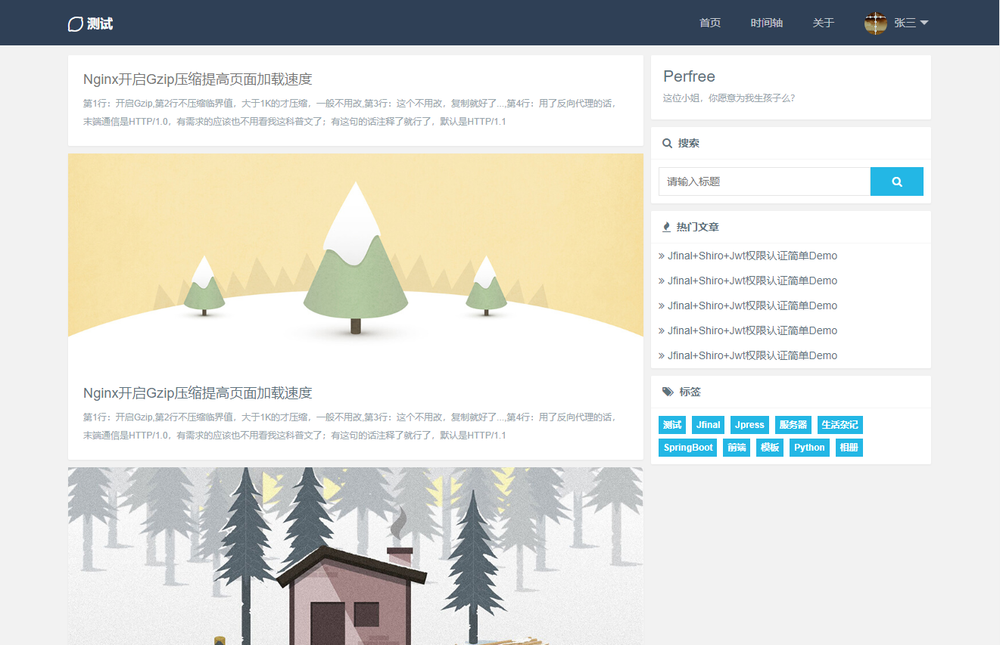
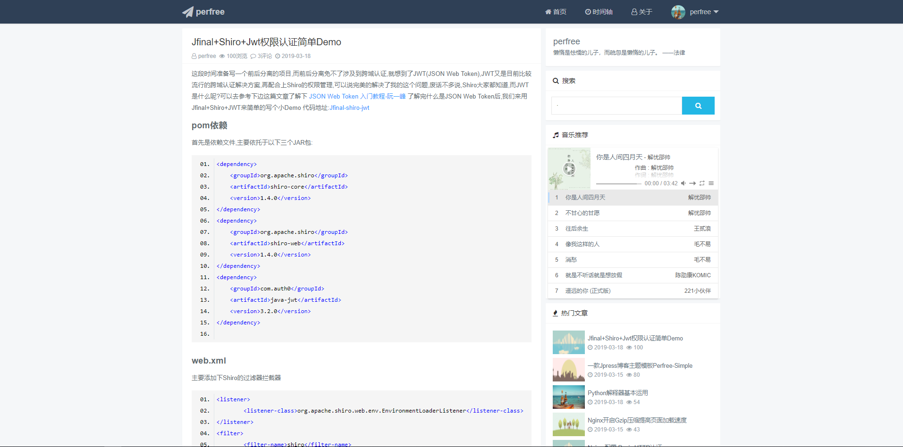
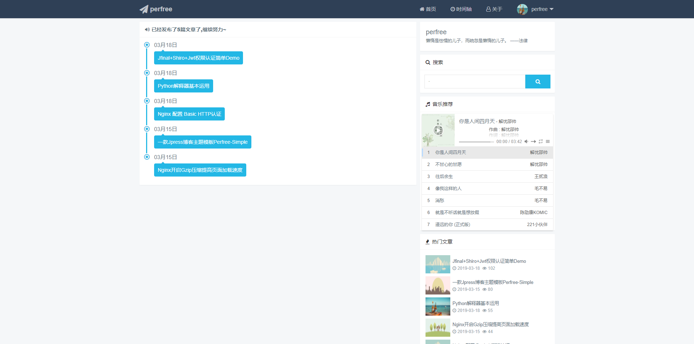
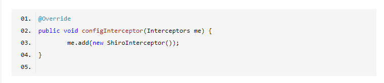
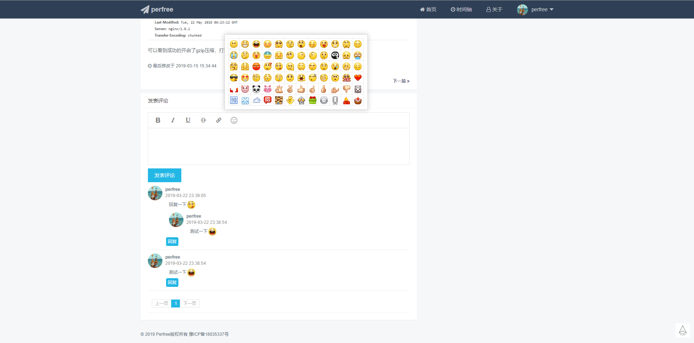
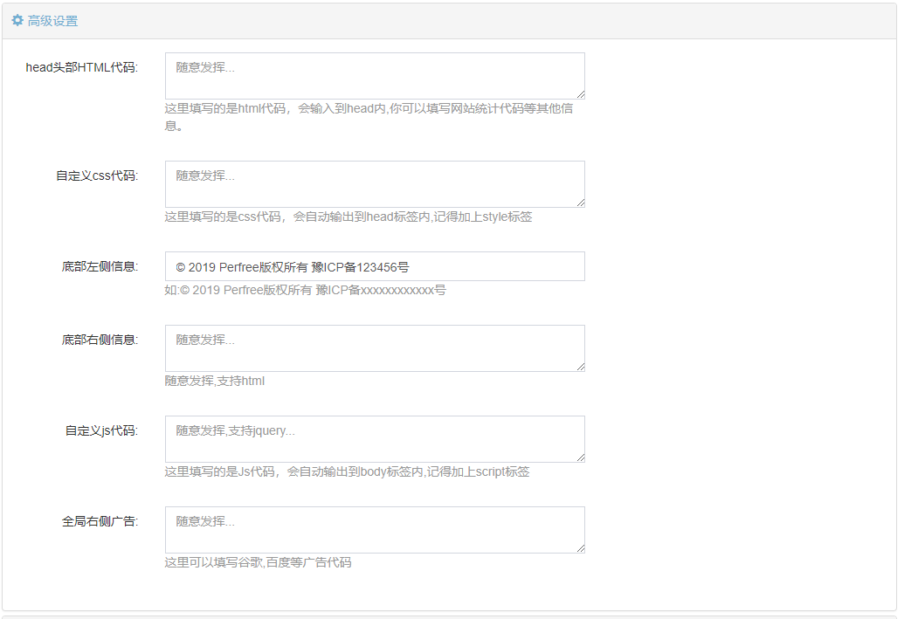
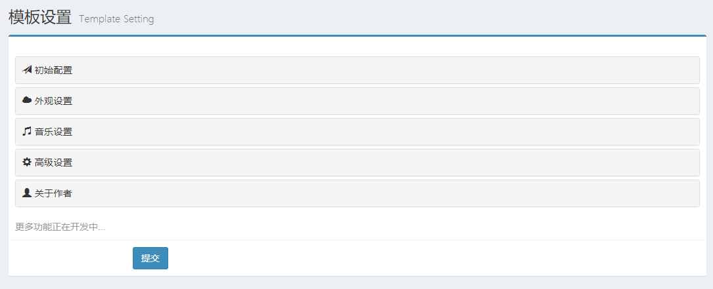

## Perfree-Simple
一个简简单单的jpress博客主题模板,持续更新中...
简介:
1. 简约清新的样式
2. 支持响应式,手机,PC无缝连接
3. 一言接口随机优美文字
4. 代码高亮(支持89种样式,支持行号显示)
5. 全局音乐播放器，配合pjax实现切换页面音乐不停止播放,支持网易云,QQ音乐歌单
6. 支持自定义js代码
7. 支持自定义css代码
8. 支持自定义广告位
9. 时间轴(归档)页面,记录你的创作痕迹
10. 支持相册插件(收费插件需要购买)
11.友链插件的支持(免费插件,即装即用)
12. 支持公告设置
13. 支持文章置顶设置
14. 支持主题更换,默认提供三套主题
15. 随机彩色标签云
16. 支持文章打赏
17. .......

更多功能增加中...

> 注意:
> 相册插件为收费插件(29元),可自行选择使用或不使用,需要插件可联系我QQ741223257
> 友链插件为免费插件,可自由下载安装: [下载地址](https://github.com/perfree/Perfree-Link)

## 下载及文档
[Demo在线预览](http://www.jpress.yinpengfei.com)

[模板下载](https://github.com/perfree/jpress-perfree-simple/releases)

[使用文档](http://www.simple.perfree.top)

> 关于主题更新:请关注主题下载地址,出现新的更新直接下载,将原有的模板卸载再安装新版即可,不会丢失数据~
> 如若喜欢,欢迎Start/Fork

## 简单预览
首页

文章页

时间轴

代码高亮

评论表情

相册

友情链接

后台设置

## 注意事项
1. 请尽量使用Markdown编辑器(语法入门),该主题支持较为全面,富文本编辑器不推荐(也是可以用的)
2. 遇到问题先去翻翻文档哦
3. 如果你有新的想法或者bug反馈,请前去QQ群进行反馈

QQ群:617389368 你只管创作,其它交给我~
